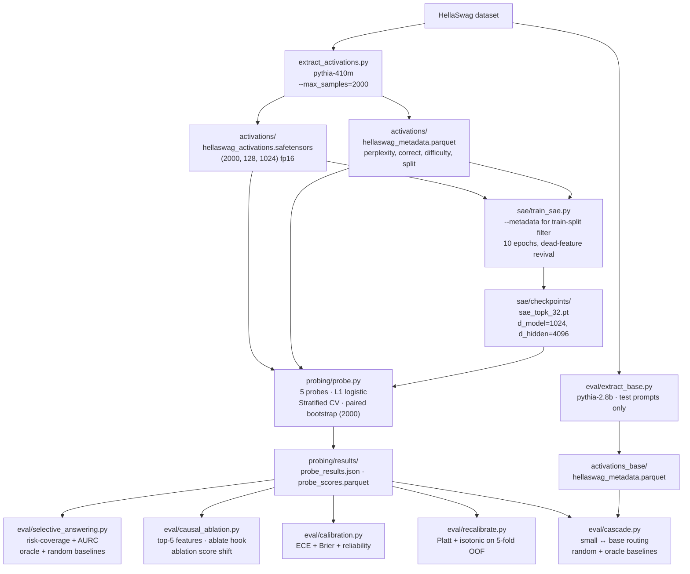

# LLM Bridge Project: Do SAE Features Predict LLM Correctness Beyond Activations?

Sparse-autoencoder features from a Language Model as a learned signal for answer correctness, routing, and selective prediction — plus a Platt-recalibrated selective answering engine, a real small↔base cascade, and a hook-based causal ablation of top features.

## Question

Do SAE features add predictive power for answer correctness **on top of** cheap prompt-level input statistics and raw activations — i.e., does the model's internal representation know something about its own correctness that the prompt doesn't already reveal? **And if not**, can we still recover a deployable selective answering/abstention signal from the cheap baseline?

The headline metric is **incremental** AUROC with paired-bootstrap CIs:

- `P1` = input-stats only (the prompt-level baseline that matters)
- `P2` = input-stats + raw activations
- `P3` = input-stats + SAE features
- `P4` / `P5` = raw-only / sae-only (diagnostic isolations — where does signal live?)
- deltas: `P2 − P1`, `P3 − P1`, and `P3 − P2` (neutralizes the dimensionality argument: SAE vs. raw, both high-dim)

## Pipeline (where every artifact comes from)



## Repo layout

```
README.md                                    # this file
requirements.txt                             # pinned deps
reproduce.sh                                 # one-command pipeline (steps 1..7)
smoke_test.py                                # one-prompt sanity check (hook & shapes)

extract_activations.py                       # Layer 12 residual hook, zero-shot eval,
                                             # prompt deduplication + contamination purge
                                             # --max_samples, --max_seq_len

sae/sae_model.py                             # TopK SAE + aux-k dead-feature revival (verbatim)
sae/train_sae.py                             # trains SAE on TRAIN-split tokens only

probing/features.py                          # 8 prompt statistics (the cheap baseline)
probing/probe.py                             # P1..P5 probes, stratified topic CV,
                                             # paired-bootstrap ΔAUROC

eval/extract_base.py                         # Pythia-2.8B evaluation on test prompts only
eval/cascade.py                              # cost-accuracy Pareto for small↔base cascade
eval/causal_ablation.py                      # Mishra-style hook-based ablation of top-5 features
eval/selective_answering.py                  # risk-coverage / AURC / oracle / random
eval/calibration.py                          # reliability diagram + ECE + Brier
eval/recalibrate.py                          # Platt + isotonic recalibration (5-fold OOF)
eval/report_template.md                      # 6-page workshop template
eval/populate_report.py                      # populates report.md from results JSON
```

## Load-Bearing Methodology Constraints

1. **Benchmark Selection (The Sweet-Spot Accuracy Rule)**: 
   The single biggest risk in difficulty prediction is that the small baseline model is too weak. If Pythia-410M gets ~25% on MMLU or ~5% on GSM8K, almost every question is answered incorrectly. This leaves near-zero variance in the binary target label (i.e. almost all labels are `1` / incorrect), eliminating the predictive signal. We select **HellaSwag** validation because Pythia-410M zero-shot accuracy sits around **41–47%** — the absolute "sweet spot" (40–70%) for binary difficulty prediction.
2. **Difficulty Labels Based on Binary Correctness**: 
   While time-series forecasting uses normalized CRPS quantiles as continuous difficulty labels, LLM answer difficulty is cast as a binary label: `1` if the zero-shot model prediction is incorrect, `0` if correct.
3. **Length-Normalized Log-Likelihood Zero-Shot Scoring**: 
   To score HellaSwag choices without free-form generation noise, we evaluate the prompt + each candidate completion and compute the conditional log-likelihood. To prevent Pythia from always favoring shorter endings, scores are length-normalized by the ending token length.
4. **SAE Trained on Train-Split Prompt Activations Only**: 
   Fitting the SAE on the full dataset represents an unsupervised leakage pathway that can inflate probe performance. The $1024 \rightarrow 4096$ TopK SAE is trained exclusively on Layer 12 activations generated by HellaSwag train-split prompts.
5. **Same (mean,max,last) Pooling for Raw and SAE**: 
   Sequence pooling aggregates activations across the 4 HellaSwag candidate completions using `concat(mean, max, last)`. The identical aggregation is applied to raw representations and SAE codes alike to keep the comparison fair.
6. **Stratified stratified-by-topic CV**: 
   Since prompt validation data lacks temporal ordering, the inner CV splits are stratified by the composite key of HellaSwag activity category and target label. This prevents topic leakage across CV folds when optimizing the L1 penalty $C$.
7. **Paired Bootstrap**: 
   For ΔAUROC CIs, we resample test indices once per bootstrap iteration and reuse them for all probes and deltas. This paired bootstrap is the only mathematically rigorous way to evaluate the headline `P3 − P2` (SAE over raw) incremental predictive power.
8. **Pile Pretraining Contamination Purge**: 
   As Biderman et al. (2023) document in the Pythia scaling suite paper, large-scale web pretraining corpora like "The Pile" suffer from documented benchmark overlap (including HellaSwag). Verbatim prompt exposure causes rote memorization, leaking answers into internal representation layers. 

## Anticipated Non-Obvious Risks & Mitigation Strategies

1. **Multiple-Choice Granularity vs. Continuous Distributions**:
   Unlike TSFMs where difficulty is derived from continuous forecast sample spreads (CRPS), multiple-choice benchmarks like HellaSwag define difficulty via coarse binary correctness. This makes the labels noisier and harder for representations to predict against. 
   - *Mitigation*: We flag this upfront in the paper draft. If probes $P1 \dots P5$ collapse to similar chance-level AUROC scores, we pre-register a pivot in Week 4 to include a free-form benchmark (e.g. TriviaQA or OpenbookQA) where generation entropy provides a richer difficulty signal.
2. **Layer-Dependent Representation Geometry**:
   While TSFM mid-encoder layers capture structural forecast features (Mishra, 2026), autoregressive LLM predictive representations for answer correctness ("will I answer correctly") concentrate in the latter 25–35% of layers (around layers 18–20 of 24 in Pythia-410M). Post-hoc cherry-picking of layers is prohibited.
   - *Mitigation*: We pre-register and run a cross-layer robustness sweep over two pre-selected target layers: **Layer 12** (mid-residual stream, `gpt_neox.layers[11]`) and **Layer 18** (late-residual stream, `gpt_neox.layers[17]`). We report point estimates and paired bootstrap intervals for both layers to ensure a rigorous, unbiased comparison.


## Running

```bash
# Setup virtual environment and dependencies
python3 -m venv venv && source venv/bin/activate
pip install -r requirements.txt

# Run the complete pipeline (Steps 1/7 to 7/7)
bash reproduce.sh
```
