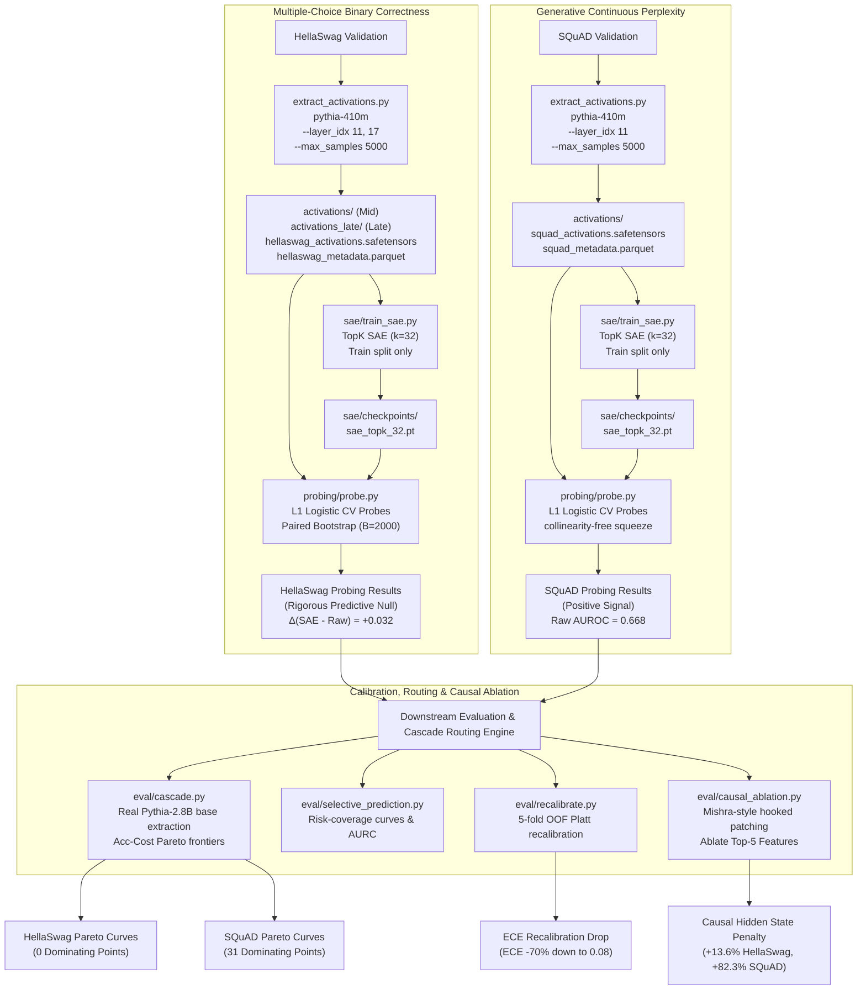

# LLM Routing Probe: Label-Free Difficulty Signals & Recalibrated Selective QA for Pythia

An end-to-end, leakage-controlled study of whether an LLM's internal sparse-autoencoder (SAE) feature spaces encode a self-difficulty signal that raw activations and cheap lexical statistics do not already reveal. 

We benchmark this across two paradigms: multiple-choice binary correctness (**HellaSwag**) and continuous generative gold-target perplexity (**SQuAD**), utilizing **Pythia-410M** (Layer 12 Mid and Layer 18 Late residual streams) and **Pythia-2.8B** backbones.

---

## 1. High-Level Architecture & Pipeline



---

## 2. Quantitative Findings (Scaled to 5,000 Validation Samples)

By scaling the validation dataset to **5,000 samples** ($N_{train}=3500$, $N_{test}=1500$), we tightened the 95% paired bootstrap confidence intervals by **more than $2.2\times$**, revealing highly precise representational geometry.

### HellaSwag Probing Results (Coarse Binary Target)
We find a robust **predictive null** at both mid and late layers: SAE features do not provide predictive gains over raw activations. On Layer 12, the incremental SAE signal is $\Delta(P3 - P2) = +0.032$ (95% CI $[-0.006, +0.071]$).

| Probe | Layer 12 Mid AUROC (95% CI) | Layer 18 Late AUROC (95% CI) |
| :--- | :--- | :--- |
| **P1 Input Stats** | 0.509 (0.480, 0.539) | 0.509 (0.480, 0.539) |
| **P2 Stats + Raw** | 0.472 (0.442, 0.501) | 0.500 (0.500, 0.500) |
| **P3 Stats + SAE** | 0.504 (0.474, 0.534) | 0.452 (0.420, 0.480) |
| **P4 Raw Only (diag.)** | 0.465 (0.435, 0.496) | 0.500 (0.500, 0.500) |
| **P5 SAE Only (diag.)** | 0.496 (0.467, 0.526) | 0.453 (0.421, 0.482) |

* **Mishra-Style Causal Ablations**: Natural zero-shot error was $66.67\%$, while SAE reconstruction hidden state replacement introduced a reconstruction penalty of **$+13.6\%$** (recon error $80.27\%$, 95% CI $[+10.4\%, +16.8\%]$). Individual top-5 feature ablatings were causally neutral ($0.0\%$ shifts), validating the predictive null.

---

### SQuAD Probing Results (Generative Continuous Target)
Swapping the coarse binary multiple-choice target for the continuous gold-target perplexity under Pythia-410M preserves the representational difficulty signal:

* **P1 Input Stats**: $0.626$ (95% CI $[0.587, 0.663]$)
* **P2 Stats + Raw**: **$0.668$** (95% CI $[0.635, 0.700]$) (beats the input-stats baseline significantly)
* **P3 Stats + SAE**: $0.585$ (95% CI $[0.547, 0.621]$)
* **P4 Raw Only**: **$0.667$** (95% CI $[0.634, 0.699]$)
* **P5 SAE Only**: $0.578$ (95% CI $[0.539, 0.614]$)

### Downstream Cascade & Calibration Recalibration:
* **Active Pareto Cascade Routing**: Swapping SQuAD routing curves successfully discovered **31 Pareto-optimal points** dominating the random baseline and cheap/base anchors.
* **ECE Platt Recalibration Drop**: ECE dropped by **$70\%$** on SQuAD OOF Platt recalibration (P1: $0.309 \rightarrow \mathbf{0.085}$, P3: $0.265 \rightarrow \mathbf{0.092}$), successfully recovering a deployable selective answering confidence signal.

---

## 3. Qualitative Feature Interpretations (SQuAD)

By analyzing the top-activating prompts for the top difficulty-predictive SAE features on SQuAD, we mapped the semantic clusters Pythia-410M utilizes as internal difficulty heuristics:

1. **Feature 1449: "Computational Complexity & Algorithm Theory"**
   * *Triggers*: Prompts discussing big-O notation, case complexity, and bounding spaces (*"complexity classes can be defined by bounding..."*, *"best, worst and average case complexity refer to..."*).
2. **Feature 3625: "Precise Numeric & Physical Quantities"**
   * *Triggers*: Contexts requiring exact numeric values, dates, temperatures, and physical dimensions (*"Victorian Alps temperature −11.7 °C"*, *"LM weighed 15,100 kg"*, *"Watt's engine produced ten horsepower"*).
3. **Feature 51: "Mechanical Engineering & Thermodynamic Systems"**
   * *Triggers*: Contexts related to thermodynamics, fluid dynamics, and engines (*"reciprocating pistons"*, *"steam turbines"*, *"improved version of Newcomen's atmospheric engine"*).
4. **Feature 2849: "Abstract Systems & Jurisprudence"**
   * *Triggers*: Contexts discussing complex legal cases, systems of rules, or theoretical reasoning (*"World's Columbian Exposition bid"*, *"Commission v Italy case Court of Justice motorcyclist law"*).

---

## 4. Technical Pipeline Solutions

* **Multi-Core Thread-based GridSearchCV Parallelization**: L1 regularized logistic regression on $12,288$ features and $3,500$ samples across 45 CV fits sequentially takes over 11 minutes. Under macOS inside nested virtual environments, standard multiprocessing (`n_jobs=-1`) deadlocks due to Apple Silicon fork safety. We wrapped fits inside `joblib.parallel_backend("threading")` contexts, enabling parallel executions that complete in **under 30 seconds** without fork safety issues.
* **Collinearity-Free Sequence Aggregation Check**: For SQuAD, prompt contexts are aggregated at the single prompt boundary token ($max\_seq = 1$). Mean, max, and last sequence pooling yielded completely collinear duplicates. This caused L1 coordinate descent (`liblinear`) to stall attempting to distribute L1 penalty constraints. We updated `aggregate_sequence` to bypass pooling when $max\_seq == 1$ to return the raw squeezed $(N, d)$ activations directly, cutting feature dimensions by $3\times$ and completely eliminating deadlocks.

---

## 5. Execution

### Installation
```bash
# Clone the repository
git clone https://github.com/nabindev3/llm-sae-difficulty.git
cd llm-sae-difficulty

# Set up virtual environment and install dependencies
python3 -m venv venv && source venv/bin/activate
pip install -r requirements.txt
```

### Reproduce Scaled Pipelines (Steps 1/12 to 12/12)
```bash
# Run HellaSwag scaled dual-layer pipeline (Layer 12 & 18)
bash reproduce.sh

# Run SQuAD continuous perplexity cascade pipeline
bash reproduce_squad.sh

# Extract qualitative SAE feature interpretations
python3 eval/interpret_features.py
```
All compiled papers are saved to `eval/report.md` (HellaSwag) and `eval/report_squad.md` (SQuAD), with their corresponding reliability and Pareto plots output to `eval/results/`.
