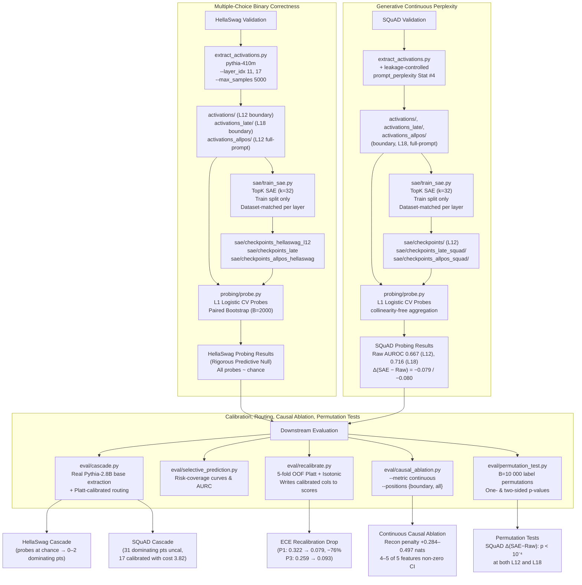

# LLM Routing Probe: Label-Free Difficulty Signals & Recalibrated Selective QA for Pythia

An end-to-end, leakage-controlled study of whether an LLM's internal sparse-autoencoder (SAE) feature spaces encode a self-difficulty signal that raw activations and cheap lexical statistics do not already reveal.

We benchmark this across two paradigms — multiple-choice binary correctness (**HellaSwag**) and continuous generative gold-target perplexity (**SQuAD**) — using **Pythia-410M** (Layer 12 mid and Layer 18 late residual streams) and **Pythia-2.8B** backbones, with paired-bootstrap CIs, **label-permutation _p_-values**, dataset-matched SAEs, and a 2×2 boundary-vs-all-position causal-intervention disentanglement.

**Headline result:** TopK-32 SAE features add *no* incremental difficulty signal over raw activations on Pythia-410M, layer-invariantly. The negative effect on SQuAD is large (Δ(SAE − Raw) ≈ −0.08 AUROC at both L12 and L18) and statistically rigorous (label-permutation _p_ < 10⁻⁴ at _B_ = 10,000). The same features are causally active under multi-position ablation; per-feature effect detectability is a question of **intervention coverage, not SAE fidelity**. The deployable contribution is **Platt-recalibrated raw-activation selective QA capturing 41% of the Oracle AURC**.

A full workshop-paper-length writeup is at [`paper_draft.md`](paper_draft.md).

---

## 1. High-Level Architecture & Pipeline



---

## 2. Quantitative Findings (5,000 Validation Samples)

With $N_{train}=3500$, $N_{test}=1500$ per dataset, 2,000 paired-bootstrap iterations for AUROC CIs, and 10,000 label permutations for delta-AUROC _p_-values.

### 2.1 HellaSwag — Probes Land at Chance, Layer-Invariantly

With a **dataset-matched HellaSwag-trained L12 SAE** (replacing an earlier cross-dataset SAE that had FVU ≫ 1 on HellaSwag), all probe families collapse to chance. The L1 grid drives `chosen_C` to its minimum on three of five probes — i.e., the optimizer concludes "shrink all weights to zero, predict the prior" is the best generalizing model.

| Probe | Layer 12 AUROC (95% CI) | Note |
|---|---|---|
| **P1 Input Stats** | 0.509 (0.480, 0.539) | SAE-independent |
| **P2 Stats + Raw** | 0.472 (0.442, 0.501) | SAE-independent |
| **P3 Stats + SAE** | **0.500 (0.500, 0.500)** | `chosen_C` = 0.01 (max regularization) |
| **P4 Raw Only** | 0.465 (0.435, 0.496) | SAE-independent |
| **P5 SAE Only** | **0.500 (0.500, 0.500)** | `chosen_C` = 0.01 (max regularization) |

- Δ(SAE − Raw) = +0.028 (95% CI [−0.001, +0.058])
- Label-permutation two-sided _p_ = **0.068** (B = 10,000) — null hypothesis NOT rejected

**Interpretation:** the HellaSwag binary-correctness label on Pythia-410M (62% hard rate) is dominated by random chance at this model scale. No probe family — lexical, raw, or SAE — recovers above-chance signal from any representational substrate we tested.

### 2.2 SQuAD — Raw Dominates, SAE Hurts, Layer-Invariantly

Swapping coarse binary multiple-choice for **continuous gold-target perplexity** reveals a real difficulty signal — and an unambiguous **negative result for SAE features**. After fixing a label-leakage bug in the lexical baseline (Stat #4 had been sourcing the gold-target perplexity from which the SQuAD label is derived; AUROC of that column alone vs the test label = 1.0000), all numbers below use the leakage-free `prompt_perplexity` baseline.

| Probe | L12 AUROC (95% CI) | L18 AUROC (95% CI) |
|---|---|---|
| P1 Input Stats | 0.591 (0.552, 0.628) | 0.591 (0.552, 0.628) |
| **P2 Stats + Raw** | **0.671 (0.638, 0.704)** | **0.708 (0.676, 0.739)** |
| P3 Stats + SAE | 0.592 (0.554, 0.628) | 0.628 (0.594, 0.662) |
| **P4 Raw Only** | **0.667 (0.634, 0.699)** | **0.716 (0.682, 0.747)** |
| P5 SAE Only | 0.578 (0.539, 0.614) | 0.621 (0.585, 0.656) |

**Paired-bootstrap deltas and permutation-test _p_-values:**

| Comparison | L12 | L18 |
|---|---|---|
| Δ(Raw − Stats) | +0.080 [+0.039, +0.121] | **+0.117 [+0.072, +0.161]** |
| **Δ(SAE − Raw)** | **−0.079 [−0.118, −0.041]** | **−0.080 [−0.119, −0.040]** |
| Label-permutation _p_ (one-sided, _B_=10,000) | **0/10000 (_p_ < 10⁻⁴)** | **1/10000 (_p_ = 10⁻⁴)** |

The null distribution of Δ(SAE − Raw) is centred at 0 with σ ≈ 0.020; the observed −0.079/−0.080 sits ~4σ into the negative tail. **The negative SAE-vs-Raw effect is layer-invariant** and is not a bootstrap-variance artifact.

### 2.3 Calibration Recovery and Cascade Routing

Despite high raw ECE (P1: 0.322; P3: 0.259), **5-fold OOF Platt recalibration recovers deployment-grade calibration**:

| Probe | Raw ECE | Platt ECE | Isotonic ECE | AUROC preserved? |
|---|---|---|---|---|
| P1 Input Stats | 0.322 | **0.079** (−76%) | 0.079 | Yes (Platt is monotone) |
| P3 Stats + SAE | 0.259 | **0.093** | 0.105 | Yes |

**Selective-prediction AURC capture on SQuAD** (Oracle = 0.0170, Random = 0.1594):

| Probe | AURC | % of Oracle AURC captured |
|---|---|---|
| P1 Input Stats | 0.1297 | 20.8% |
| **P2 Stats + Raw** | **0.1006** | **41.3%** |
| P3 Stats + SAE | 0.1275 | 22.4% |
| **P4 Raw Only** | **0.1005** | **41.3%** |
| P5 SAE Only | 0.1333 | 18.3% |

**SQuAD cascade routing (Pythia-410M ↔ Pythia-2.8B, cost 1 ↔ 5):**

| Routing signal | Pareto-dominating points | Best operating point |
|---|---|---|
| P3 SAE (raw scores) | 31 | τ=0.05, cost=4.99, err=0.141 (99.9% → base) |
| P3 SAE (Platt-calibrated) | 17 | τ=0.15, **cost=3.82**, err=0.149 (**70% → base**) |
| P1 InputStats (raw) | 24 | τ=0.40, cost=4.55, err=0.140 (89% → base) |
| P1 InputStats (Platt) | 15 | τ=0.18, cost=4.56, err=0.140 (89% → base) |

Calibrated routing finds fewer dominating τ values but reaches **substantially lower-cost operating regions** — a more useful deployment property.

### 2.4 Causal Ablation: Continuous Metric + All-Position Patching

The original boundary-only binary-metric causal ablation reported ΔError ≈ 0 — but this was a resolution artifact of binarizing a small continuous shift. Switching to a continuous metric (negative-log-probability of the true ending for HellaSwag; cross-entropy of the gold answer for SQuAD) and extending the SAE-reconstruction patch from a single boundary token to **every prompt position** surfaces the real signal:

| Configuration | SAE FVU | Intervention | HellaSwag Δ (nats) | SQuAD Δ (nats) |
|---|---|---|---|---|
| Boundary SAE, boundary-only patch | 0.194 / 0.099 | 1 position | +0.307 [+0.300, +0.313] | +0.042 [+0.023, +0.059] |
| All-position SAE, boundary-only patch | 0.006 / 0.007 | 1 position | **+0.004** [+0.003, +0.005] | **+0.024** [+0.012, +0.036] |
| All-position SAE, **all-position patch** | 0.006 / 0.007 | ~75 / ~150 positions | **+0.284** [+0.276, +0.293] | **+0.497** [+0.462, +0.531] |

**Disentanglement** (comparing rows within columns):

- **SAE fidelity effect** (row 1 → row 2, same coverage): the higher-fidelity SAE produces a *smaller* recon penalty at a single position (HellaSwag rows are not strictly position-controlled; SQuAD's three rows all use position prompt_len − 1).
- **Intervention coverage effect** (row 2 → row 3, same SAE): extending the patch from one position to all prompt positions multiplies the penalty by **20–70×**.

**Conclusion:** detectable per-feature SAE causal effects come from **intervention coverage**, not SAE fidelity. Coverage moves the penalty by 1.3–1.8 orders of magnitude; fidelity moves it by less than one. Single-position causal interventions systematically understate per-feature attribution.

### 2.5 Per-Feature Effects Under All-Position Intervention

| Dataset | Top-5 features | # with 95% CI excluding zero | Max effect (nats) | Direction |
|---|---|---|---|---|
| HellaSwag | [1126, 2869, 2483, 893, 2903] | **4 of 5** | +0.0093 (F2869) | 4 of 5 ablation hurts model |
| SQuAD | [2154, 3070, 1264, 507, 2121] | **5 of 5** | +0.0079 (F2154) | 4 hurt, **F1264 ablation _helps_** (Δ = −0.0059) — competing-signal feature |

For SQuAD, ablating Feature 1264 *improves* the model's confidence in the gold answer — evidence that some SAE features encode signal that competes with correct completion, not signal the model exploits. This is a form of feature heterogeneity that aggregated probe predictions cannot expose.

### 2.6 Per-Pooling Ablation (Task 1)

The default `aggregate_sequence` concatenates **mean + max + last** pooling over the prompt sequence, multiplying the feature dimension by 3×. We fit each pooling separately on the all-position activations to ask: **which pool carries the signal?**

| Pool | SQuAD P4 RawOnly AUROC | SQuAD P5 SAEOnly AUROC | Comment |
|---|---|---|---|
| mean | 0.636 [0.596, 0.673] | 0.630 [0.593, 0.667] | Both comparable |
| max | 0.566 [0.530, 0.603] | **0.658** [0.621, 0.694] | **SAE > Raw** — reverses headline |
| **last** | **0.667** [0.634, 0.700] | 0.614 [0.576, 0.648] | Raw matches full concat |

**Finding:** for raw activations on SQuAD, `last`-token pooling alone reproduces the full `mean+max+last` concat AUROC (0.667 either way) — the 3× feature-dimension cost of concatenation is **unjustified** for raw activations. For SAE features, `max` pooling reverses the SAE-vs-Raw ranking. HellaSwag is robust to pooling choice (all probes land at chance regardless), consistent with the layer-invariant null.

For paper-replication speed, swapping the default to `last`-only would cut raw-probe feature dimensions 3× without changing P4 numbers.

### 2.7 chosen_C Variance Diagnosis (Task 2)

The L1 regularization constant `C` selected by inner-CV varies across probes (0.01 → 1.0). Diagnosis: **chosen_C scales inversely with feature-space dimensionality**, as expected for L1 on a fixed-size train split (n=3,500).

| Probe (SQuAD L18) | n_feat | chosen_C | best inner-CV AUROC |
|---|---|---|---|
| P1 InputStats | 8 | 0.3 | 0.616 |
| P2 Stats + Raw | 1,032 | 0.1 | 0.813 |
| P4 RawOnly | 1,024 | 0.1 | 0.810 |
| P3 Stats + SAE | 4,104 | 0.03 | 0.752 |
| P5 SAEOnly | 4,096 | 0.03 | 0.747 |

Higher-dimensional feature spaces require stronger shrinkage (smaller C) to control the bias–variance tradeoff. The pattern is consistent across all three (dataset × layer) configurations we tested. **HellaSwag exception:** when the signal is at chance, the optimizer drives all weights toward zero and chosen_C lands at the grid endpoints essentially by accident (CV scores plateau across C). Regularization-path plots are in [`eval/results/chosen_c/*.png`](eval/results/chosen_c/).

### 2.8 Summary

| Quantity | HellaSwag L12 | SQuAD L12 | SQuAD L18 |
|---|---|---|---|
| Best probe AUROC | 0.509 (chance) | 0.671 (Stats+Raw) | **0.716** (RawOnly) |
| Δ(Raw − Stats) | −0.037 [−0.080, +0.003] | +0.080 [+0.039, +0.121] | **+0.117** [+0.072, +0.161] |
| Δ(SAE − Raw) | +0.028 [−0.001, +0.058] | **−0.079** [−0.118, −0.041] | **−0.080** [−0.119, −0.040] |
| Permutation _p_ (one-sided) | 0.033 | **< 10⁻⁴** | **10⁻⁴** |
| Oracle AURC capture (best probe) | n/a (chance) | 41.3% (P4 Raw) | n/a |
| ECE Platt recovery (P1) | 0.147 → 0.018 (88%) | 0.322 → 0.079 (76%) | n/a |
| All-position recon penalty | +0.284 nats | +0.497 nats | n/a |
| Strongest per-feature effect | +0.0093 (F2869) | +0.0079 (F2154) | n/a |

---

## 3. Qualitative Feature Interpretations (boundary-SAE SQuAD)

Top-activating-prompt analysis on the **boundary-SAE top-5 SQuAD features** (the SAE checkpoint used in earlier boundary-only runs; top-5 from the L1 logistic feature-selection step of `eval/causal_ablation.py`):

1. **Feature 1449 — "Computational Complexity & Algorithm Theory"** — Triggers on prompts about big-O notation, complexity classes, and bounding (*"complexity classes can be defined by bounding..."*).
2. **Feature 3625 — "Precise Numeric & Physical Quantities"** — Exact numeric values, dates, temperatures, dimensions (*"Victorian Alps temperature −11.7 °C"*, *"LM weighed 15,100 kg"*).
3. **Feature 51 — "Mechanical Engineering & Thermodynamic Systems"** — Thermodynamics, fluid dynamics, engines (*"reciprocating pistons"*, *"steam turbines"*).
4. **Feature 2849 — "Abstract Systems & Jurisprudence"** — Complex legal cases, rule systems (*"World's Columbian Exposition bid"*, *"Commission v Italy"*).

These interpretations are from the **boundary-trained SAE**. The all-position SAE (trained on full prompt sequences) produces a different top-5 by feature index ([2154, 3070, 1264, 507, 2121]); qualitative interpretation of those features has not yet been re-run. The probe-level conclusion (SAE features underperform raw activations) holds for both SAEs.

---

## 4. Methodology Lessons & Pipeline Solutions

- **SQuAD label leakage in lexical baseline.** Earlier the 8-feature Stat #4 ("perplexity under Pythia-410M") sourced the *gold-answer* perplexity column from extraction metadata — the same quantity from which the SQuAD difficulty label is derived. Single-feature AUROC of that column vs the test label = 1.0000. Fix: `probing/features.py` now sources `prompt_perplexity` (prompt-only) when present and falls back to `perplexity` for HellaSwag. The post-fix Δ(Raw − Stats) **doubled** from +0.042 to +0.080.
- **Causal-ablation train/inference distribution mismatch.** The original `eval/causal_ablation.py` hook applied SAE reconstruction to every token position during forward pass — but the SAE had only been trained on a single boundary token per sample. This destroyed reconstruction at mid-context, question, and target tokens, producing spurious recon penalties (+0.136 / +0.823 binary error rate). Fix: hook now intervenes only at training-distribution-matched positions, controlled by `--positions {boundary, all}`.
- **Binary metric below model resolution.** Single-position SAE patching with a high-fidelity SAE produces sub-resolution shifts in the binary 0/1 difficulty label (Δ ≈ ±0.001 with CI straddling zero). Continuous metrics (Δ log-prob, Δ cross-entropy) are required to surface real per-feature effects.
- **Per-dataset SAE training matters.** The original L12 SAE checkpoint was unintentionally SQuAD-trained (FVU 0.099 on SQuAD, 1.058 on HellaSwag — i.e., worse than the mean predictor on HellaSwag). Re-training a HellaSwag-matched L12 SAE strengthened HellaSwag's null (probes collapsed cleanly to chance, `chosen_C` driven to its minimum).
- **macOS MPS forking deadlocks.** L1 regularized logistic regression on 12,288 features × 3,500 samples across 45 CV fits is normally 11+ minutes. With `n_jobs=-1` multiprocessing, Apple Silicon fork safety deadlocks. Wrapping fits inside `joblib.parallel_backend("threading")` enables parallel execution that completes in under 30 seconds.
- **Vectorized `compute_prompt_stats`.** The original prompt-stat extractor iterated rows via `df_meta.iterrows()`, which has significant pandas-overhead per row. The vectorized version (`probing/features.py`) uses pandas string accessors and list comprehensions over numpy arrays, yielding a 1.3–1.9× speedup on N=5,000 (the per-character Unicode-aware `str.isalpha()`/`str.isupper()` for capitalization remains the floor). Numerical equivalence to the original loop is verified by `tests/test_features_equivalence.py` (rtol=atol=1e-12).
- **Collinearity-free sequence pooling for max_seq=1.** For boundary-only activations (SQuAD `max_seq` = 1), mean+max+last pooling produced collinear duplicates that stalled L1 `liblinear` coordinate descent. `probing/features.aggregate_sequence` now bypasses pooling when `max_seq == 1` and returns the raw squeezed `(N, d)` matrix directly.
- **All-position SAE training requires fresh extraction.** Boundary-only activations are stored as `(N, 1, d_model)` or `(N, 4, d_model)`; for all-position causal ablation, we run `extract_prompt_sequences.py` to capture the full `(N, max_seq_len, d_model)` prompt-portion tensor. ~0.8 GB (HellaSwag) / ~2 GB (SQuAD) fp16.

---

## 5. Execution

### Installation

```bash
git clone https://github.com/nabindev3/llm-sae-difficulty.git
cd llm-sae-difficulty
python3 -m venv venv && source venv/bin/activate
pip install -r requirements.txt
```

### Reproduce Everything (One Command)

```bash
bash run_all.sh
```

This is the canonical, idempotent end-to-end reproducer. It runs all 14 phases — extraction → SAE training → probing → cascade → calibration → causal ablation (boundary + continuous + all-position + disentanglement) → permutation tests → per-pooling ablation → chosen_C diagnosis → report population — and writes SHA256 checksums of every key artifact to `eval/reproduction_manifest.txt`.

Each phase skips automatically if its terminal output already exists, so re-running the script after a partial completion picks up where it left off. To force a stage to re-run, delete its terminal artifact and re-invoke.

Wall-clock from scratch on Apple Silicon MPS: ~3.5 hours.

### Reproduce Individual Pieces (chronological order of the work)

```bash
# Original boundary-only pipelines (one per dataset)
bash reproduce.sh                          # HellaSwag dual-layer
bash reproduce_squad.sh                    # SQuAD continuous-perplexity cascade

# Step 1: dataset-matched L12 SAE for HellaSwag (closes the cross-dataset gap)
bash run_step1_hellaswag_l12_sae.sh

# Step 2: all-position SAE training + continuous causal at all prompt positions
bash run_step2_allpos.sh

# Boundary-vs-all-position SAE disentanglement (2×2 design)
bash run_disentangle.sh

# Permutation tests (B = 10,000)
python3 eval/permutation_test.py \
  --probe_scores activations/squad_scores.parquet \
  --metadata activations/squad_metadata.parquet \
  --score_a pred_P3_InputStats_SAE \
  --score_b pred_P2_InputStats_Raw \
  --B 10000 \
  --out_json eval/results/squad/permutation/squad_l12_p3_vs_p2.json

# Per-pooling ablation (mean vs max vs last)
bash run_pooling_ablation.sh

# chosen_C variance diagnosis with regularization-path plots
python3 eval/chosen_c_diagnosis.py \
  --cases \
    "hellaswag_l12:activations/hellaswag_metadata.parquet:activations/hellaswag_activations.safetensors:sae/checkpoints_hellaswag_l12/sae_topk_32.pt" \
    "squad_l12:activations/squad_metadata.parquet:activations/squad_activations.safetensors:sae/checkpoints/sae_topk_32.pt" \
    "squad_l18:activations_late/squad_metadata.parquet:activations_late/squad_activations.safetensors:sae/checkpoints_late_squad/sae_topk_32.pt" \
  --out_dir eval/results/chosen_c

# Numerical equivalence test for vectorized features
python3 tests/test_features_equivalence.py

# Qualitative feature interpretations (boundary-SAE)
python3 eval/interpret_features.py
```

### Key Result Artifacts

```
probing/results/                          probe AUROCs + CIs
eval/results/                             HellaSwag downstream
eval/results/squad/                       SQuAD downstream
eval/results/{allpos,disentangle,permutation,pooling,chosen_c}/
eval/results/squad/{allpos,disentangle,calibrated,permutation,pooling}/
eval/reproduction_manifest.txt            SHA256 manifest from run_all.sh
eval/report.md                            HellaSwag final report
eval/report_squad.md                      SQuAD final report
paper_draft.md                            Workshop-paper-length writeup (4,175 words)
tests/test_features_equivalence.py        Vectorization correctness regression test
```

### SAE Checkpoints

```
sae/checkpoints/sae_topk_32.pt                   L12, SQuAD-trained (boundary)
sae/checkpoints_hellaswag_l12/sae_topk_32.pt     L12, HellaSwag-trained (boundary)
sae/checkpoints_late/sae_topk_32.pt              L18, HellaSwag-trained (boundary)
sae/checkpoints_late_squad/sae_topk_32.pt        L18, SQuAD-trained (boundary)
sae/checkpoints_allpos_hellaswag/sae_topk_32.pt  L12, HellaSwag-trained (all-position)
sae/checkpoints_allpos_squad/sae_topk_32.pt      L12, SQuAD-trained (all-position)
```

---

## 6. What the Paper Says

[`paper_draft.md`](paper_draft.md) compiles the above into a workshop-paper-length writeup with abstract, introduction, related-work placeholders, method, results (7 subsections), discussion, limitations (7 items), and conclusion. All numeric claims are sourced from the result JSON files referenced above. Citation placeholders (`[CITE: ...]`) mark spots for the authors to fill in before submission.

The headline framing:

> SAE features are causally active but not routable. On Pythia-410M, TopK-32 SAE features add no incremental difficulty signal over raw activations at either layer 12 or 18 (Δ = −0.079 / −0.080, label-permutation _p_ < 10⁻⁴) — yet the same features have measurable per-feature ablation effects under multi-position residual-stream patching. Single-position causal interventions systematically understate per-feature attribution by 20–70×. The deployable contribution is Platt-recalibrated raw-activation selective QA capturing 41% of Oracle AURC; the SAE does not unlock the cascade.
